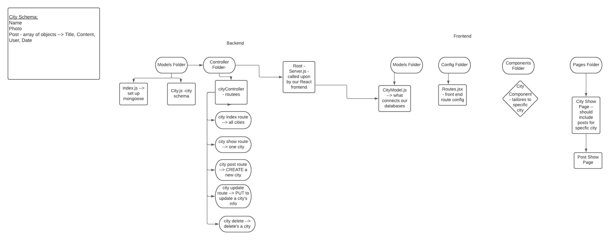
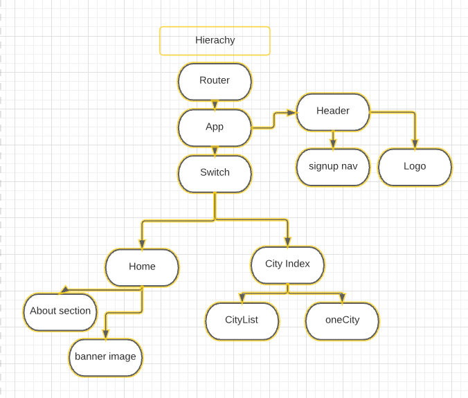

# Wanderer
We've created a bright, travel site that any wanderer can come take joy in and find community. Especially for those times when they are out in the world exploring away from their natural habitat and seeking to share adventures with like-minded individuals. 

## Technologies Used
* Trello - project planning
* Figma - app design and mockups
* Node.js
* Javascript
* Express
* Mongoose & MongoDB
* CSS
* React
    * React Carousel
    * React Router 
* Unsplash - picture library

## WireFrames

ERD Model & Route Flow

React Component Model

## User Stories
### Who is the user?
Our user is the budding or seasoned traveller who revels in exploring new places and cultures and wants to share it with the ever-growing travel community. 

### Existing Features
* Visual-first landing page with multiple React components rendered over a parallax simulated background
* Easy to navigate navbar that takes the user betweeen the home and about page
* An all cities grid-implemented visual navigation, at the end of the landing page, that takes users to previously travelled cities
* A city show page with:
    * a picture of the city
    * form to add a post 
    * ability to view added posts for the city they've been created in
    * ability to edit or delete old posts
    * ability to click the post title and be taken to a post show page
* A post show page that allows the user to view the post title and content

## Planned Features
If we continued to work on our project, we'd like to create solutions for the features listed below:
* User Signup/Login
* Adding Comments to Posts
* Editing/Deleting Comments
* Visual Map with markers of where the community has been
* Form Validators

## Triumphs
Being able to scroll through compnents on the landing page was a challenge that we were able to transform into a win, once we were able to implement it into our project. Being able to come together as a team the night before the project was due and bring a collective vision to life after a week of struggling, helped make the final product something we could be proud of. 

## Challenges
Being able to execute all our user experience goals within the time frame turned out to be a challenge due to learning the new React material and understanding how to best utilize it. It was also a challenge to figure out how to get all the components to render on the landing page to create a seamless user scroll experience. Lastly, since our app is a mostly visual experience, curating high quality photos that kept to the theme of the website proved to be more time-consuming than initially thought.